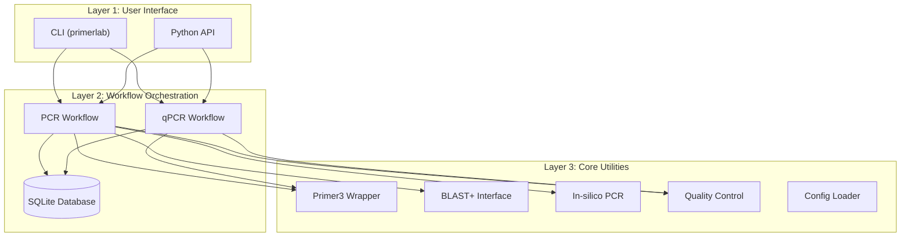
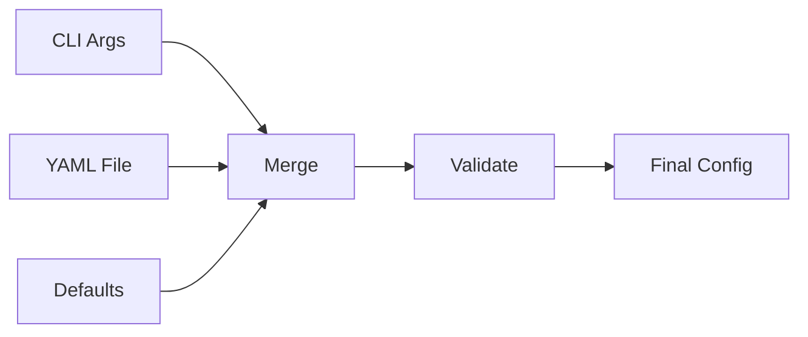

# System Architecture

PrimerLab uses a three-tier architecture for maintainability and flexibility.

## Overview



---

## Layer 1: User Interface

### Command Line Interface

The CLI is the primary entry point for most users:

```bash
primerlab run pcr --config my_config.yaml
```

Key files:

- `primerlab/cli/main.py` — Command routing and argument parsing
- Rich library for formatted output

### Python API

For programmatic access:

```python
from primerlab import design_pcr_primers
result = design_pcr_primers(sequence="ATGC...", tm_opt=60.0)
```

Key files:

- `primerlab/api/public.py` — 15+ public functions

---

## Layer 2: Workflow Orchestration

Workflows coordinate multi-step processes.

### PCR Workflow

1. Load and validate configuration
2. Call Primer3 for candidate generation
3. Apply quality control filters
4. Rank candidates
5. (Optional) Run in-silico PCR validation
6. (Optional) Run BLAST off-target check
7. Generate reports
8. Save to database

### qPCR Workflow

Same as PCR, plus:

1. Probe design
2. Probe-primer compatibility check
3. Melt curve prediction (SYBR)

### Database

All designs are persisted to SQLite:

- `~/.primerlab/history.db`

Enables:

- Design history tracking
- Result comparison
- Reproducibility

---

## Layer 3: Core Utilities

### Primer3 Wrapper

Interfaces with the Primer3 tool:

```python
from primerlab.core.tools.primer3_wrapper import Primer3Wrapper

wrapper = Primer3Wrapper()
candidates = wrapper.design(sequence, parameters)
```

### Quality Control

Evaluates primer quality:

| Check | Threshold |
|-------|-----------|
| Self-dimer ΔG | > -5 kcal/mol |
| Hairpin ΔG | > -2 kcal/mol |
| 3' stability | No G/C runs |
| GC content | 40-60% |

### In-silico PCR

Simulates amplification to validate primer binding:

```python
from primerlab.core.insilico.engine import InsilicoPCR

engine = InsilicoPCR()
products = engine.amplify(forward, reverse, template)
```

### Off-target Finder

BLAST-based specificity analysis:

```python
from primerlab.core.offtarget.finder import OfftargetFinder

finder = OfftargetFinder(database_path)
hits = finder.search(primer_sequence)
```

---

## Configuration Pipeline



Priority: CLI args > YAML file > Defaults

---

## Error Handling

Standardized exception hierarchy:

```
PrimerLabError (base)
├── ConfigurationError
├── SequenceError
├── DesignError
├── ValidationError
└── DependencyError
```

Each error includes:

- `error_code` — Standardized code (e.g., `ERR_CONFIG_001`)
- `message` — Human-readable description
- `details` — Context dictionary
