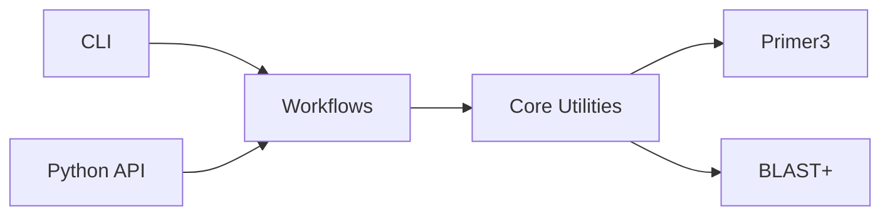

# PrimerLab Documentation

**PrimerLab** is a modular bioinformatics framework for automated primer and probe design.

<div class="grid cards" markdown>

- :material-rocket-launch: **Quick Start**

    ---

    Design your first primers in 5 minutes

    [:octicons-arrow-right-24: Get Started](guides/quickstart.md)

- :material-book-open-variant: **Guides**

    ---

    Step-by-step tutorials for PCR and qPCR design

    [:octicons-arrow-right-24: View Guides](guides/index.md)

- :material-console: **Reference**

    ---

    CLI, API, and configuration documentation

    [:octicons-arrow-right-24: Reference](reference/cli.md)

- :material-lightbulb: **Concepts**

    ---

    Understand how PrimerLab works

    [:octicons-arrow-right-24: Learn More](concepts/index.md)

</div>

---

## Installation

```bash
pip install primerlab-genomic
```

Verify installation:

```bash
primerlab --version
primerlab health
```

---

## Key Features

| Feature | Description |
|---------|-------------|
| **PCR Design** | Standard primer design with quality control |
| **qPCR Design** | TaqMan and SYBR Green assay design |
| **In-silico PCR** | Virtual amplification validation |
| **Off-target Check** | BLAST-based specificity analysis |
| **Batch Processing** | Multi-sequence design |
| **Species Specificity** | Cross-reactivity testing |

---

## Quick Example

```bash
# Create configuration
cat > my_config.yaml << 'EOF'
input:
  sequence_path: ./gene.fasta
parameters:
  tm:
    opt: 60.0
  product_size:
    min: 150
    max: 300
EOF

# Design primers
primerlab run pcr --config my_config.yaml
```

---

## Architecture

PrimerLab uses a three-tier design:



Learn more: [System Architecture](concepts/architecture.md)

---

## Version

Current version: **v1.0.1**

See [Changelog](changelog.md) for version history.

---

## Links

- [GitHub Repository](https://github.com/engkinandatama/primerlab-genomic)
- [PyPI Package](https://pypi.org/project/primerlab-genomic/)
- [DeepWiki Docs](https://deepwiki.com/engkinandatama/primerlab-genomic)
