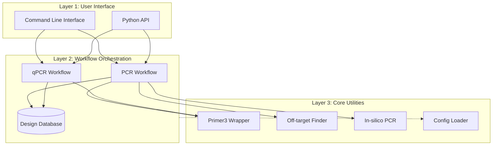

# PrimerLab Documentation

Welcome to PrimerLab, a modular bioinformatics framework for automated primer and probe design.

## Quick Links

- [Getting Started](getting-started.md) - Installation and first steps
- [Tutorials](tutorials/README.md) - Step-by-step guides
- [CLI Reference](cli/README.md) - Command-line interface
- [Configuration](configuration/README.md) - Config file reference
- [Features](features/README.md) - Advanced features
- [API Reference](api/README.md) - Programmatic interface
- [Architecture](architecture.md) - System design
- [Troubleshooting](troubleshooting.md) - Common issues and solutions

## What is PrimerLab?

PrimerLab is a Python-based toolkit for automated primer and probe design in molecular biology workflows. It provides:

- **PCR** — Standard primer design with quality control
- **qPCR** — Probe design (TaqMan/SYBR) with thermodynamic checks
- **Off-target Detection** — BLAST-based specificity analysis
- **In-silico PCR** — Virtual amplification validation
- **Batch Processing** — Multi-sequence design in one command
- **Quality Control** — Hairpins, dimers, GC%, Tm validation

## System Architecture

PrimerLab allows for distinct separation of concerns through a three-tier design, ensuring reliability across both CLI and API usage.

### Three-Tier Design

1. **Layer 1 (User Interface)**
    - **CLI**: Handles argument parsing, command routing, and rich output formatting.
    - **API**: Provides programmatic access for integration into other Python scripts.

2. **Layer 2 (Workflow Orchestration)**
    - **Workflows**: Orchestrates multi-step processes (e.g., `run_pcr_workflow`, `run_qpcr_workflow`) including design, validation, and reporting.
    - **Database**: Persists design history and results to SQLite.

3. **Layer 3 (Core Utilities)**
    - **Wrappers**: Interfaces with external tools like Primer3 and BLAST+.
    - **Engines**: Core logic for In-silico PCR and specificity checking.
    - **Config**: Centralized configuration management.

## Version

Current version: **v1.0.0**

See [CHANGELOG](../CHANGELOG.md) for version history.
